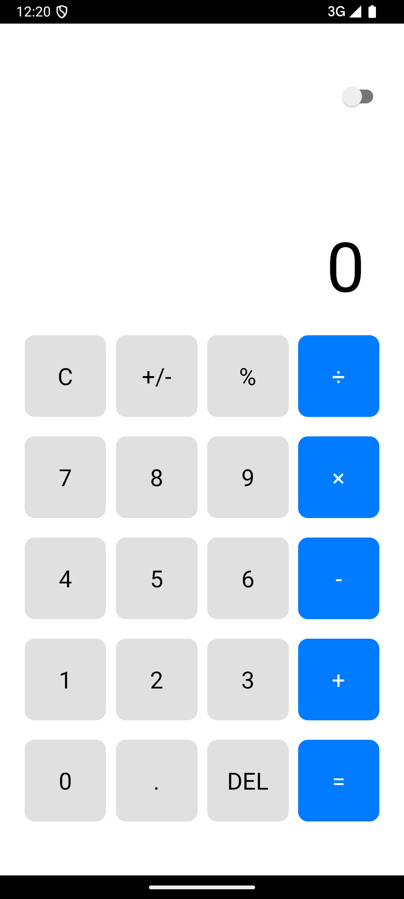
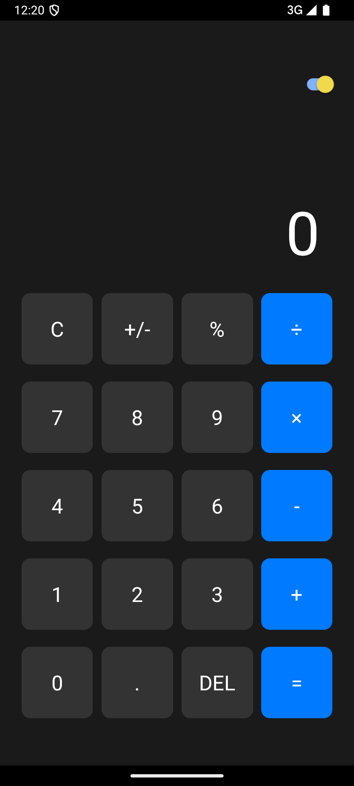

# React Native Calculator App

A modern calculator app built with React Native that supports both light and dark themes. This calculator provides basic arithmetic operations with a clean, iOS-style interface.

## Features

- Basic arithmetic operations (addition, subtraction, multiplication, division)
- Percentage calculations
- Sign toggle (+/-)
- Clear entry and clear all functionality
- Dark/Light theme toggle
- Last equation display
- Delete button to remove last digit
- Long press on C to clear history

## Screenshots

<div style="display: flex; justify-content: space-between;">
  <div style="flex: 1; margin-right: 10px;">
    <h3>Light Theme</h3>
    
  </div>
  <div style="flex: 1; margin-left: 10px;">
    <h3>Dark Theme</h3>
    
  </div>
</div>

## Technical Details

Built using:
- React Native
- TypeScript
- React Hooks (useState)
- StyleSheet for styling

## Key Components

- Theme switcher using Switch component
- Dynamic styling based on theme
- Responsive grid layout for calculator buttons
- History display showing last calculation
- Large display for current number input

## Installation

1. Clone the repository:
    ```bash
    git clone https://github.com/Pmvita/Calculator-v2.git
    ``` 

2. Install dependencies:
    ```bash
    cd Calculator-v2
    yarn install
    ```

3. Run the app:
    ```bash
    yarn start
    ```

## License

MIT License 

Copyright (c) 2023 Pierre Mvita

Permission is hereby granted, free of charge, to any person obtaining a copy
of this software and associated documentation files (the "Software"), to deal
in the Software without restriction, including without limitation the rights
to use, copy, modify, merge, publish, distribute, sublicense, and/or sell
copies of the Software, and to permit persons to whom the Software is
furnished to do so, subject to the following conditions:

The above copyright notice and this permission notice shall be included in all
copies or substantial portions of the Software.

THE SOFTWARE IS PROVIDED "AS IS", WITHOUT WARRANTY OF ANY KIND, EXPRESS OR
IMPLIED, INCLUDING BUT NOT LIMITED TO THE WARRANTIES OF MERCHANTABILITY,
FITNESS FOR A PARTICULAR PURPOSE AND NONINFRINGEMENT. IN NO EVENT SHALL THE
AUTHORS OR COPYRIGHT HOLDERS BE LIABLE FOR ANY CLAIM, DAMAGES OR OTHER
LIABILITY, WHETHER IN AN ACTION OF CONTRACT, TORT OR OTHERWISE, ARISING FROM,
OUT OF OR IN CONNECTION WITH THE SOFTWARE OR THE USE OR OTHER DEALINGS IN THE
SOFTWARE.
